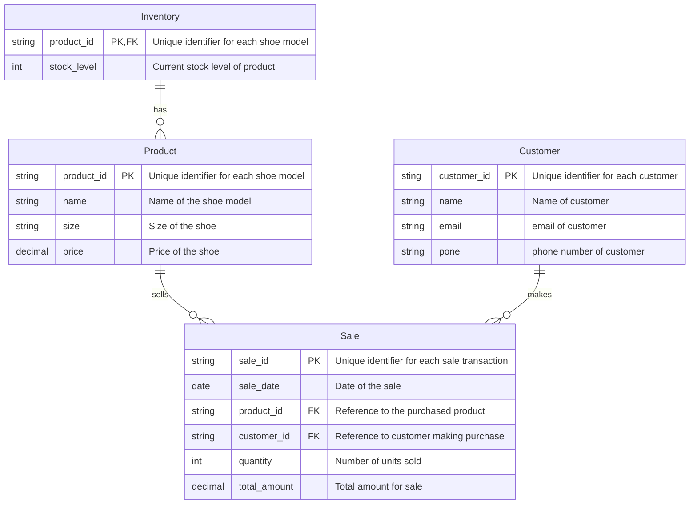

# Nike Store Entity Relationship Diagram 
This outlines the ERD for the Nike Store, illustrating the relationships and constraints between the various entities involved in the store's operations.
## Entity Relationship Diagram 

## Entity Descriptions 
### 1. Product 
* product_id: Unique identifier for each shoe model (Primary Key).
* name: Name of the shoe model. 
* size: Size of shoe.
* price: Price of the shoe. 
* **Significance**: The Product entity helps track what is available to sell and manages pricing and stock levels. 
### 2. Customer 
* customer_id: Unique identifier for each customer (Primary Key). 
* name: Name of customer.
* email: Email to communicate with customer. 
* phone: Phone number to communicate with customer. 
* **Significance**: The Customer entity makes sure to have good customer management and great customer service. 
### 3. Sale 
* sale_id: Unique identifier for each sale transaction (Primary Key).
* sale_date: Date of when the sale happened.
* product_id: Links to the purchased product (Foreign Key).
* customer_id: Links to the customer making the purchase (Foreign Key). 
* quantity: Number of units sold in the transaction. 
*total_amount: Total revenue from the sale. 
* **Significance**: The Sale entity is crucial for tracking revenue, looking at sales trends, and analyzing customer purchasing habits.
### 4. Inventory 
* product_id: Unique identifier for each shoe model (Primary Key and Foreign Key).
* stock_level: Current stock of product. 
* **Significance**: The Inventory entity is crucial for stock management and ensuring the store can meet customer demands without being overstocked or understocked. 

## Relationship Descriptions 
* Product to Sale: This is a one to many relationship. One product can be sold in multiple transactions. Which helps track how often products are purchased to inform how much is needed. 
* Customer to Sale: This is a one to many relationship. One customer can make many purchases over time. Allows the business to analyze customer behavior. 
* Inventory to Product: This is a one to many relationship. There can be many of the same product one hand in the inventory. Allows the store to manage inventory and monitor stock levels. 
